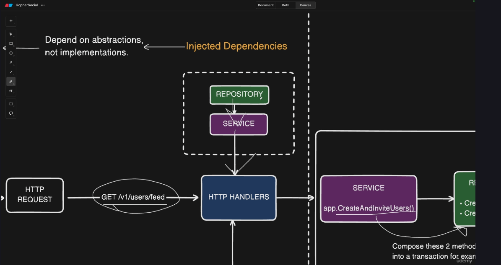

# Social 

## Folder structure
/bin - contains the binary executable (dist)
/cmd - entry points
/cmd/api - main server
/cmd/migrate - db migrations 
/internal - holds all internal packages (isolated from the entire app, not exported)
/docs - docs from swagger
/scripts - script for running server etc (misc/util/helper)
/web - contains the web (frontend)

## Notes for self

- Separation of concerns: each level in program is separated by a clear barrier, transport layer, service layer, storage layer etc
- Dependency Inversion Principle (DIP): inject dependencies in layers, don't directly call them, why? promotes loose coupling and makes it easier to test our programs
- Adaptability to change: keep the code modular and flexible, helps easy refactoring and easy evolve, easy to introduce new features
- systems should be easy to change
- Focus on business value: deliver whats needed.

## Layers
Transport --> Storage --> Service

